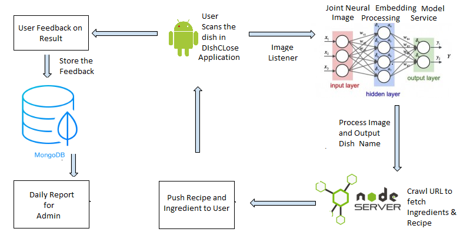

# Project-Team-9 : – Codesquad  
* Rohan Acharya
* Vajid Kagdi
* Sravya Somisetty
* Heli Dipakkumar Desai 

### Project Title : DishClose 

### Project Description:
Have you ever wondered what special ingredient makes your 
favorite dish tick? If you are a foodie who loves to cook and explore his/her culinary skills then 
DishClose is just for you. Using this system, you can find the key ingredients associated with a 
dish and also get suggestions for making a different dish using similar ingredients. With the help 
of machine learning, this system will be trained with a variety of pictures of dishes across the 
world and will constantly get better at suggestions when users upload their own recipes. 

## Solution:

We have created a smart android application in which a user can scan the image or the actual dish and the application will recognize the dish. Unlike other application where user needs to take a picture and upload it, we have simplified the process by adding a Image Listener in android which continuously check the current frame and displays the dish name if it recognizes with accuracy greater than 70%.This makes the process faster. Once the dish name is recognized, user can tap on screen to fetch the ingredients and recipe of the same. We have used Microsoft Custom Vision Service for the image recognition part which provides us with the dish name. Once the dish name is recognized we have created a REST API using Node JS which takes input the name of the dish and finds the best rated recipe as per Food2Fork ratings. Food2Fork provides the URL of the recipe. Once the recipe URL is available from Food2Fork service, the next step is to crawl the URL to fetch the ingredients and recipe form the URL. In response, the Node JS API provides JSON object containing list of ingredient and steps to cook. Users here get the option to provide the feedback which will be stored in MongoDB using Node JS API. The application also remembers the history of the scans till date and user gets the facility to fetch the recipe later. In this way it becomes a convenient option for tourists and people who migrate to learn and get accustomed to new dishes. For the admin part, we have provided a daily feedback report facility which will provide the report of user feedbacks till date in the form of Email. With the help of this report, admin will be able to analyze the false positive and false negative detections and thereby can take steps to improve the model by improving the training dataset.

### Demo

### Technology Stack 

 
<table>
<thead>
<tr>
<th>Area</th>
<th>Technology</th>
</tr>
</thead>
<tbody>
	<tr>
		<td>Front-End</td>
		<td>Android Application using Android Studio</td>
	</tr>
	<tr>
		<td>Back-End</td>
		<td>Node JS REST APIs</td>
	</tr>

<tr>
		<td>Database</td>
		<td>MongoDB Deployed on MLab</td>
	</tr>
    <tr>
		<td>Deployment</td>
		<td>Node Services deployed on Amazon AWS</td>
	</tr>
	    <tr>
		<td>Image Recognisation Service</td>
		<td>Microsoft Custom Vision (https://azure.microsoft.com/en-us/services/cognitive-services/custom-vision-service/)</td>
	</tr>
		    <tr>
		<td>Recipe Fetch API</td>
		<td>Food2Fork (http://food2fork.com/about/api)</td>
	</tr>
	    <tr>
		<td>Recipe Crawl API</td>
		<td>Mshape (https://market.mashape.com/spoonacular/recipe-food-nutrition#extract-recipe-from-website)</td>
	</tr>
<tr>
		<td>API Unit Testing</td>
		<td>Mocha, Postman</td>
	</tr>
	<tr>
		<td>Performance Testing</td>
		<td>JMeter</td>
	</tr>

</tbody>
</table>

## Architecture Diagram

## Model Trained For  
* Apple Pie
* Bruschetta
* Chicken Curry
* Club Sandwich
* Falafel
* Fried Rice
* Samosa

## Who are the users?
* Food enthusiasts wanting to sharpen their culinary skills
* Health conscious tourists who love to binge.
* Blessing for Masters students!
